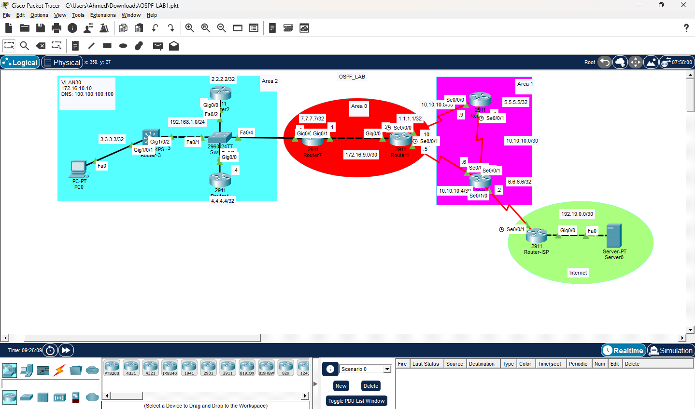

# 🚀 Multi-Area OSPF Enterprise Network with Internet Connectivity

A complete Cisco enterprise networking lab designed and implemented using **Cisco Packet Tracer**. 

This project demonstrates the design, configuration, troubleshooting, and verification of a multi-area OSPF network featuring VLAN segmentation, DHCP services, OSPF route optimization, DR/BDR election control, default route propagation, and simulated Internet connectivity.

---

## 📐 Network Topology



### OSPF Architecture & Design
* **OSPF Area 0 (Backbone):** Interconnects Core Routers.
* **OSPF Area 2:** Branch/Access segment with controlled DR/BDR election.
* **Internet Gateway:** R6 acts as the ASBR providing Internet reachability via a static default route to the ISP router.

---

## 🔧 Key Features & Technical Implementation

1. **Device Security & Management:**
   * Configured `enable secret`, local SSH/Telnet authentication, and security banners (`MOTD`).
2. **OSPF Multi-Area Tuning:**
   * Set OSPF Reference Bandwidth to `1010 Mbps` across all routers for accurate cost calculation.
   * Adjusted Hello/Dead timers between R7 and R1 (`Hello: 40s`, `Dead: 160s`).
3. **Traffic Path Manipulation:**
   * Adjusted OSPF metrics to enforce traffic from **R5** reaching **Loopback 3.3.3.3** via the preferred path:
     $$\text{R5} \longrightarrow \text{R6} \longrightarrow \text{R1}$$
4. **DR/BDR Election Control (Area 2):**
   * Configured **R7** as Designated Router (DR).
   * Configured **R2** as Backup Designated Router (BDR).
   * Configured **R4** interface priority to `0` to exclude it from the election.
5. **Internet Routing & Services:**
   * Configured R6 with a Static Default Route toward the ISP and injected it into OSPF using `default-information originate`.
   * Implemented DHCP Server on R3 for **VLAN 30** clients via SVI.
   * Configured return static route on the ISP router pointing back to internal subnets.

---

## 🧪 Troubleshooting & Verification

During the deployment phase, systematic troubleshooting was conducted to fix connectivity gaps:

* **OSPF Adjacency:** Resolved timer mismatches between R7 and R1 to form full neighbor states.
* **Routing Table Verification:** Confirmed $O$, $O_{IA}$, and $O*E2$ routes across all devices.
* **Return Path Alignment:** Verified ISP routing table to prevent asymmetric traffic drops.

### Key Verification Commands
```bash
show ip ospf neighbor
show ip route
show ip ospf interface
ping <destination-ip>
traceroute <destination-ip>
